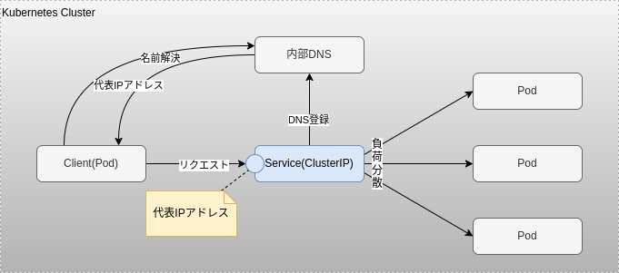
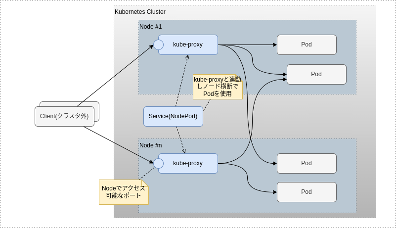
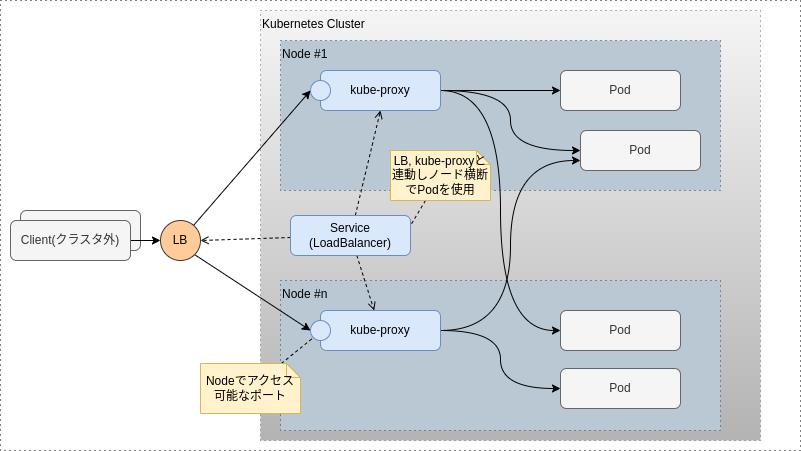
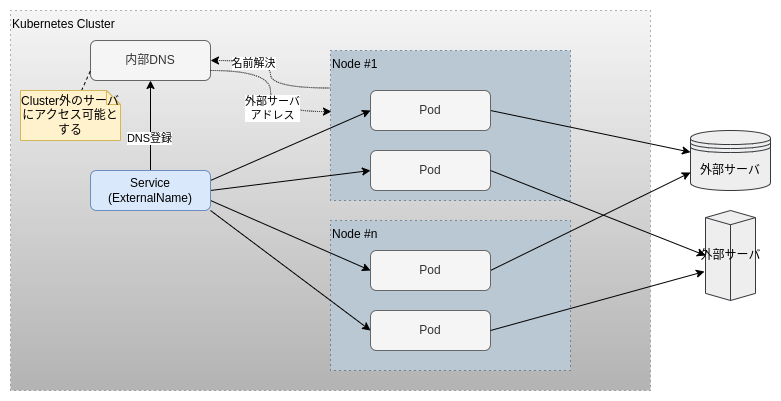

# kubernetes のサービス

サービスとは何か、サービスの 4 つのタイプを理解する

## サービス

- 永続的な IP アドレスを持たない Pod にアクセスするためのオブジェクト
- サービスには以下の 4 つのタイプがある

- ClusterIP
  デフォルト設定値であり、内部ネットワークのポッドから内部 DNS に登録された名前でアクセスできる
  Pod にアクセスするための代表 IP アドレス
- NordPort
  ClusterIP のアクセス範囲に加え、ノードの IP アドレスとポート番号を指定することで外部クラスタからもアクセスできる
- LoadBalancer
  NodePort のアクセス範囲に加えクラスタ外からも代表 IP アドレスとプロトコルのデフォルトポート番号でアクセスできる
- ExternalName
  クラスタ内から外部の IP アドレスを名前でアクセスできる

## ClusterIP

ClusterIP の概念



デプロイメント生成

```bash
$ kubectl create deployment kubernetes-bootcamp --image=gcr.io/google-samples/kubernetes-bootcamp:v1
deployment.apps/kubernetes-bootcamp created
```

サービス(ClusterIP)生成

```bash
$ kubectl expose deployment/kubernetes-bootcamp --type="ClusterIP" --port 8080
service/kubernetes-bootcamp exposed
```

生成状態を確認

```bash
$ kubectl get all
NAME                                      READY   STATUS    RESTARTS   AGE
pod/kubernetes-bootcamp-f95c5b745-lsnvn   1/1     Running   0          60s

NAME                          TYPE        CLUSTER-IP      EXTERNAL-IP   PORT(S)    AGE
service/kubernetes            ClusterIP   10.96.0.1       <none>        443/TCP    37d
service/kubernetes-bootcamp   ClusterIP   10.97.193.126   <none>        8080/TCP   18s

NAME                                  READY   UP-TO-DATE   AVAILABLE   AGE
deployment.apps/kubernetes-bootcamp   1/1     1            1           60s

NAME                                            DESIRED   CURRENT   READY   AGE
replicaset.apps/kubernetes-bootcamp-f95c5b745   1         1         1       60s
```

サービスを削除

```bash
$ kubectl delete services kubernetes-bootcamp
service "kubernetes-bootcamp" deleted
```

デプロイメントを削除

```bash
$ kubectl delete deployment kubernetes-bootcamp
deployment.apps "kubernetes-bootcamp" deleted
```

## NodePort

NodePort の概念


[3.2.アプリケーションの探索](02.01_basic.md#32アプリケーションの探索) を参照

## LoadBalancer

LoadBalancer の概念


※クラスタ環境がないためサービスを生成するあたりまで

デプロイメント生成

```bash
$ kubectl apply -f https://k8s.io/examples/service/load-balancer-example.yaml
deployment.apps/hello-world created
```

デプロイメント状態を確認
_ロードバランサがいないため`ContainerCreating`となっている_

```bash
$ kubectl get all
NAME                              READY   STATUS              RESTARTS   AGE
pod/hello-world-7476585d6-8gzkt   0/1     ContainerCreating   0          8s
pod/hello-world-7476585d6-8nwk7   0/1     ContainerCreating   0          8s
pod/hello-world-7476585d6-b82xw   0/1     ContainerCreating   0          8s
pod/hello-world-7476585d6-cddgn   0/1     ContainerCreating   0          8s
pod/hello-world-7476585d6-vjzm7   0/1     ContainerCreating   0          8s

NAME                 TYPE        CLUSTER-IP   EXTERNAL-IP   PORT(S)   AGE
service/kubernetes   ClusterIP   10.96.0.1    <none>        443/TCP   37d

NAME                          READY   UP-TO-DATE   AVAILABLE   AGE
deployment.apps/hello-world   0/5     5            0           8s

NAME                                    DESIRED   CURRENT   READY   AGE
replicaset.apps/hello-world-7476585d6   5         5         0       8s
```

デプロイメントの詳細

```bash
$ kubectl describe deployments hello-world
```

<details><summary>実行結果</summary>

```bash
bravog@k8s-master:~$ kubectl describe deployments hello-world
Name:                   hello-world
Namespace:              default
CreationTimestamp:      Thu, 04 Jan 2024 06:17:29 +0000
Labels:                 app.kubernetes.io/name=load-balancer-example
Annotations:            deployment.kubernetes.io/revision: 1
Selector:               app.kubernetes.io/name=load-balancer-example
Replicas:               5 desired | 5 updated | 5 total | 5 available | 0 unavailable
StrategyType:           RollingUpdate
MinReadySeconds:        0
RollingUpdateStrategy:  25% max unavailable, 25% max surge
Pod Template:
  Labels:  app.kubernetes.io/name=load-balancer-example
  Containers:
   hello-world:
    Image:        gcr.io/google-samples/node-hello:1.0
    Port:         8080/TCP
    Host Port:    0/TCP
    Environment:  <none>
    Mounts:       <none>
  Volumes:        <none>
Conditions:
  Type           Status  Reason
  ----           ------  ------
  Available      True    MinimumReplicasAvailable
  Progressing    True    NewReplicaSetAvailable
OldReplicaSets:  <none>
NewReplicaSet:   hello-world-7476585d6 (5/5 replicas created)
Events:
  Type    Reason             Age   From                   Message
  ----    ------             ----  ----                   -------
  Normal  ScalingReplicaSet  58s   deployment-controller  Scaled up replica set hello-world-7476585d6 to 5
```

</details>
<br>
レプリカを確認

```bash
$ kubectl get replicasets
NAME                    DESIRED   CURRENT   READY   AGE
hello-world-7476585d6   5         5         5       81s
```

```bash
$ kubectl describe replicasets
```

<details><summary>実行結果</summary>

```bash
$ kubectl describe replicasets
Name:           hello-world-7476585d6
Namespace:      default
Selector:       app.kubernetes.io/name=load-balancer-example,pod-template-hash=7476585d6
Labels:         app.kubernetes.io/name=load-balancer-example
                pod-template-hash=7476585d6
Annotations:    deployment.kubernetes.io/desired-replicas: 5
                deployment.kubernetes.io/max-replicas: 7
                deployment.kubernetes.io/revision: 1
Controlled By:  Deployment/hello-world
Replicas:       5 current / 5 desired
Pods Status:    5 Running / 0 Waiting / 0 Succeeded / 0 Failed
Pod Template:
  Labels:  app.kubernetes.io/name=load-balancer-example
           pod-template-hash=7476585d6
  Containers:
   hello-world:
    Image:        gcr.io/google-samples/node-hello:1.0
    Port:         8080/TCP
    Host Port:    0/TCP
    Environment:  <none>
    Mounts:       <none>
  Volumes:        <none>
Events:
  Type    Reason            Age   From                   Message
  ----    ------            ----  ----                   -------
  Normal  SuccessfulCreate  90s   replicaset-controller  Created pod: hello-world-7476585d6-8nwk7
  Normal  SuccessfulCreate  90s   replicaset-controller  Created pod: hello-world-7476585d6-cddgn
  Normal  SuccessfulCreate  90s   replicaset-controller  Created pod: hello-world-7476585d6-vjzm7
  Normal  SuccessfulCreate  89s   replicaset-controller  Created pod: hello-world-7476585d6-b82xw
  Normal  SuccessfulCreate  89s   replicaset-controller  Created pod: hello-world-7476585d6-8gzkt
```

</details>
<br>

サービスを生成

```bash
$ kubectl expose deployment hello-world --type=LoadBalancer --name=my-service
service/my-service exposed
```

サービスの状態を確認

_ロードバランサがないため`EXTERNAL-IP`が`<pending>`となっている_

```bash
$ kubectl get services my-service
NAME         TYPE           CLUSTER-IP       EXTERNAL-IP   PORT(S)          AGE
my-service   LoadBalancer   10.101.244.197   <pending>     8080:31012/TCP   9s
```

```bash
$ kubectl describe services my-service
```

<details><summary>実行結果</summary>

_クラスタ環境であれば`LoadBalancer Ingress`が表示される_

```bash
$ kubectl describe services my-service
Name:                     my-service
Namespace:                default
Labels:                   app.kubernetes.io/name=load-balancer-example
Annotations:              <none>
Selector:                 app.kubernetes.io/name=load-balancer-example
Type:                     LoadBalancer
IP Family Policy:         SingleStack
IP Families:              IPv4
IP:                       10.101.244.197
IPs:                      10.101.244.197
Port:                     <unset>  8080/TCP
TargetPort:               8080/TCP
NodePort:                 <unset>  31012/TCP
Endpoints:                172.16.126.19:8080,172.16.126.20:8080,172.16.194.81:8080 + 2 more...
Session Affinity:         None
External Traffic Policy:  Cluster
Events:                   <none>
bravog@k8s-master:~$ kubectl get pods --output=wide
NAME                          READY   STATUS    RESTARTS   AGE     IP              NODE          NOMINATED NODE   READINESS GATES
hello-world-7476585d6-8gzkt   1/1     Running   0          4m12s   172.16.194.82   k8s-worker1   <none>           <none>
hello-world-7476585d6-8nwk7   1/1     Running   0          4m12s   172.16.194.81   k8s-worker1   <none>           <none>
hello-world-7476585d6-b82xw   1/1     Running   0          4m12s   172.16.126.20   k8s-worker2   <none>           <none>
hello-world-7476585d6-cddgn   1/1     Running   0          4m12s   172.16.194.83   k8s-worker1   <none>           <none>
hello-world-7476585d6-vjzm7   1/1     Running   0          4m12s   172.16.126.19   k8s-worker2   <none>           <none>
```

</details>
<br>
サービスを削除

```bash
$ kubectl delete services my-service
service "my-service" deleted
```

デプロイメントを削除

```bash
$ kubectl delete deployment hello-world
deployment.apps "hello-world" deleted
```

## ExternalName

ExternalName の概念


未稿
